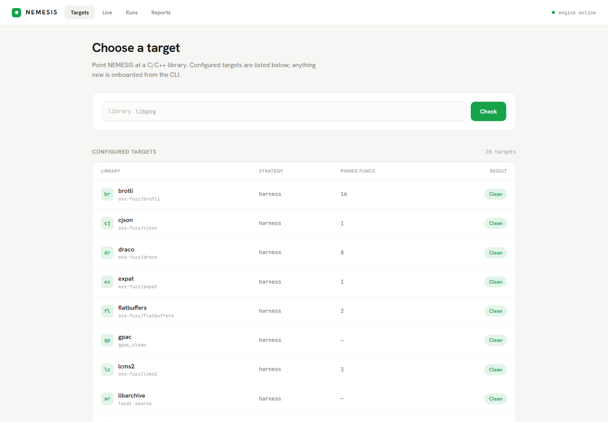
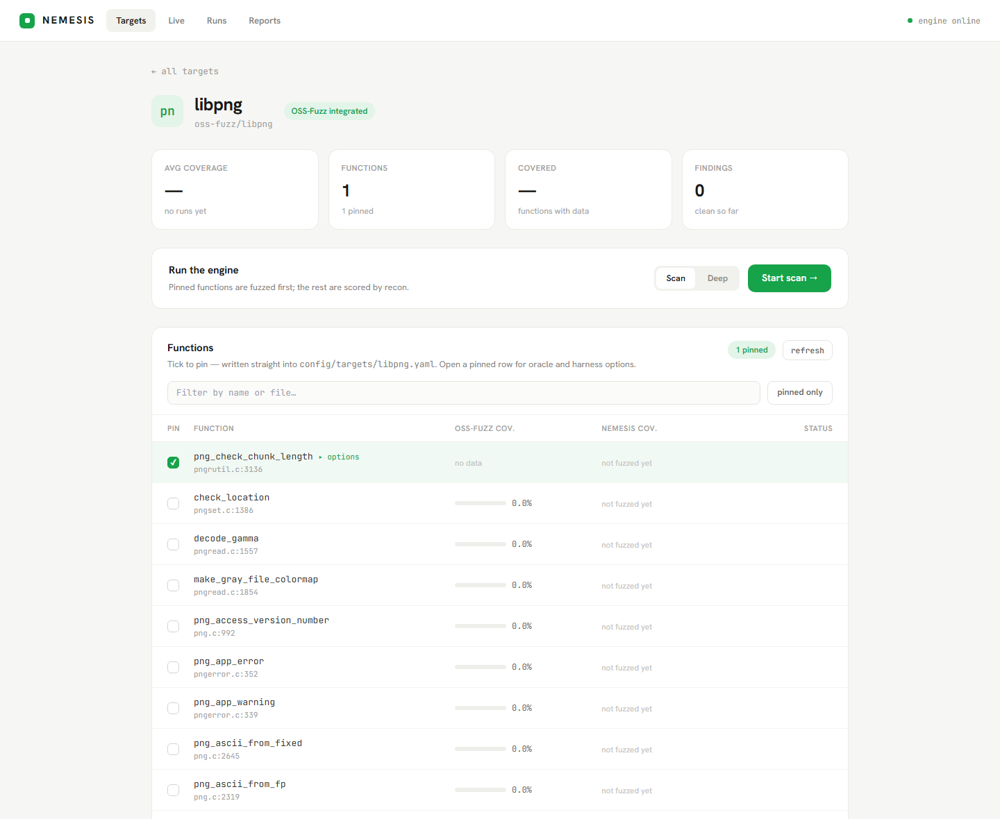
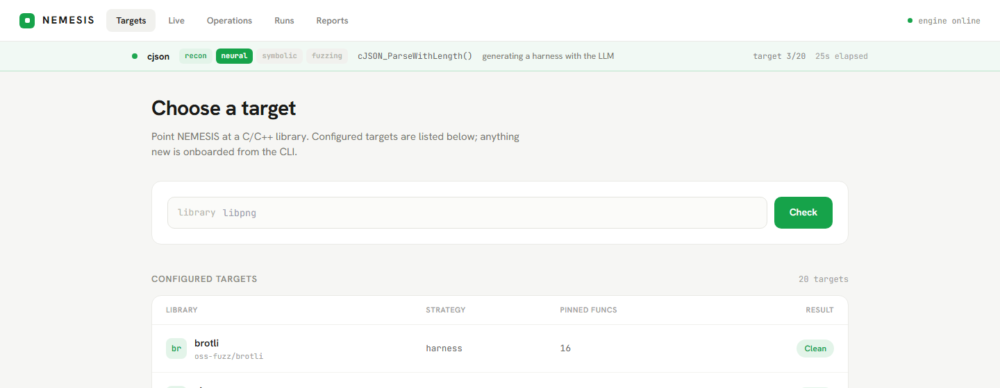
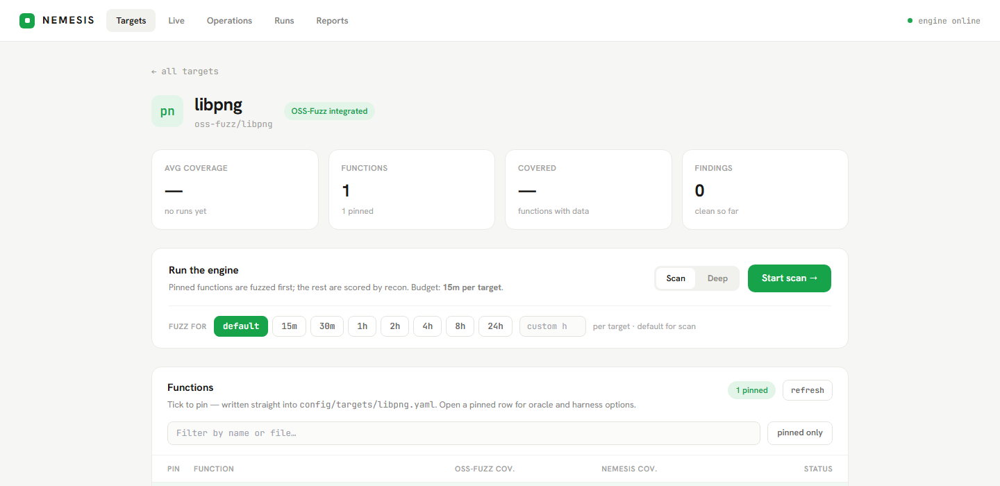
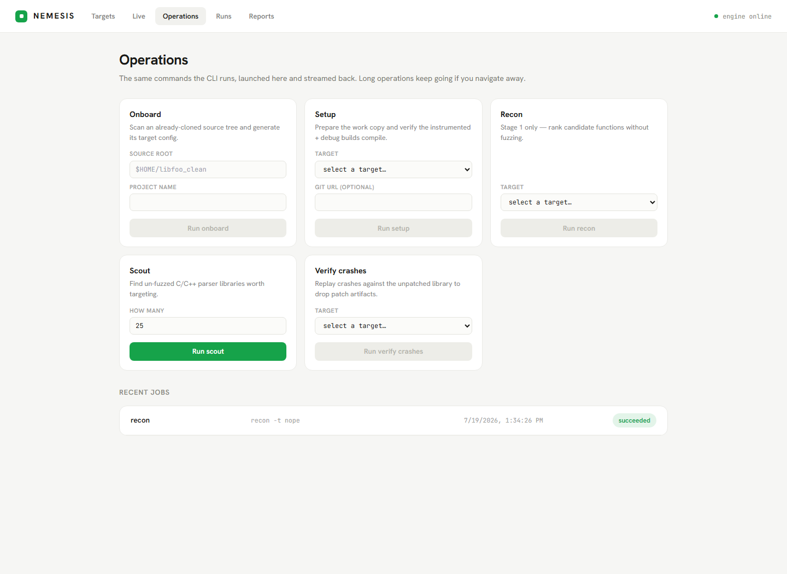
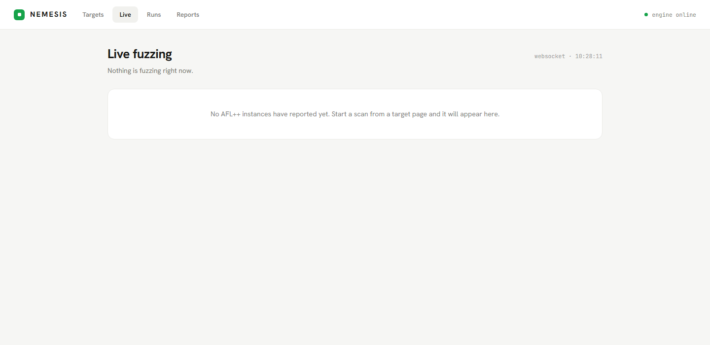
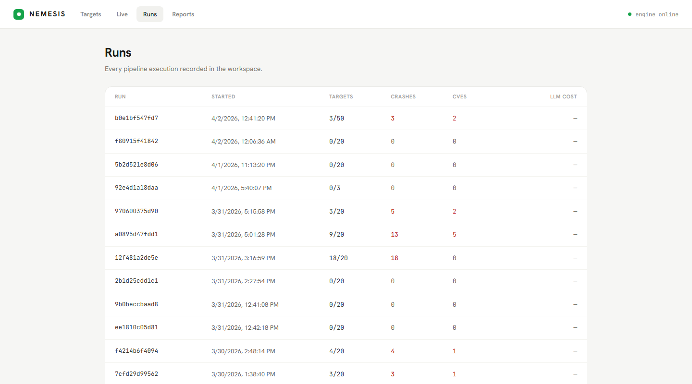

# NEMESIS

[](https://github.com/Patsakas/Nemesis/actions/workflows/ci.yml)
[](LICENSE)
[](https://www.python.org/downloads/)
[](https://github.com/AFLplusplus/AFLplusplus)
[](https://github.com/Z3Prover/z3)

**Neuro-Symbolic Exploit Mining Engine for Software Insecurities**

NEMESIS is an automated vulnerability-discovery engine for C/C++ libraries. It chains
LLM-based code reasoning, symbolic verification (Z3), and coverage-guided fuzzing (AFL++)
into a single pipeline that goes from *target selection* to *triaged crash* with no human
in the loop.

You point it at a C/C++ project. It figures out which functions are worth attacking,
writes a fuzzing harness for each, builds an instrumented binary, fuzzes it, and reports
back only the crashes that reproduce on the unmodified library.



A web dashboard ships with it: browse every function in a library side by side with its
**OSS-Fuzz coverage and the coverage NEMESIS achieved**, pin the ones worth attacking,
launch runs, and watch AFL++ live.



---

## How It Works

NEMESIS runs four stages, with a feedback loop that refines failed attempts.

```
                    +------------------+
                    |  Target Library  |   any C/C++ project
                    +--------+---------+
                             |
                    Stage 1: RECON
                    - Scan the source tree (and optional OSS-Fuzz coverage data)
                    - Find low-coverage functions that touch untrusted input
                    - Rank by memory ops, pointer arithmetic, call depth, complexity
                             |
                    Stage 2: NEURAL (LLM)
                    - Analyze each target: likely bug class, CWE, reachability blockers
                    - Generate a format-specific AFL++ harness (3 temperature variants)
                    - Extract an AFL dictionary (magic bytes) from the source
                             |
                    Stage 3: SYMBOLIC (Z3 + Build)
                    - Verify reachability constraints with Z3
                    - Auto-fix harness compile errors (LLM repair, multi-pass retry)
                    - Build an instrumented binary (AFL + ASan/UBSan, optional MSan/TSan)
                    - Pre-fuzz profiling: confirm the harness actually reaches the target
                             |
                    Stage 4: FUZZING (AFL++)
                    - Parallel AFL++ instances with format-specific seeds + dictionary
                    - Crash triage: sanitizer classification, GDB backtrace, CWE mapping
                    - Reproduce every crash against the clean, unmodified library
                             |
                    +--------+---------+
                    | Reproduces on    |
                    | clean library?   |----- yes ----> Reported as a candidate
                    +------------------+
                             | no
                    Feedback loop (max N iterations)
                    Diagnose why (0% coverage -> broken harness,
                    coverage but no crash -> different approach) and
                    send back to Stage 2 for refinement.
```

### Why it avoids false positives

Every crash is replayed against a **clean, never-modified checkout** of the target. If a
crash only shows up in a patched or instrumented build but not on the clean library, it is
discarded as an artifact. Only crashes that reproduce on the real library are reported.

### Oracles beyond "it segfaulted"

NEMESIS can detect bug classes that a plain ASan crash never surfaces, when the target
config opts in:

- **Round-trip / differential oracles** — `decode(encode(x)) == x`, or comparing a target
  against a reference implementation, to catch silent corruption and logic divergence.
- **Output invariants** — per-format safety contracts asserted after each operation.
- **MemorySanitizer** — use of uninitialized values (CWE-908).
- **ThreadSanitizer** — data races in multi-threaded harnesses (CWE-362).
- **LeakSanitizer** — memory leaks, sampled from the AFL queue post-run.

---

## Validation

NEMESIS is evaluated by **backtesting against already-published CVEs**: point it at the
vulnerable version of a library and measure whether it independently rediscovers the bug,
and how long that takes. These are reproducible — the ground truth is public.

| Library | CVE | CWE | Time to first crash | Human input |
|---------|-----|-----|--------------------|-------------|
| **libpng** | [CVE-2018-13785](https://nvd.nist.gov/vuln/detail/CVE-2018-13785) | CWE-369 divide-by-zero (via CWE-190 overflow) | **60 s** (22.7 min total pipeline) | function name + file path |
| **cJSON** | [CVE-2023-53154](https://nvd.nist.gov/vuln/detail/CVE-2023-53154) | CWE-125 out-of-bounds read | **81 s** | none — fully automatic |
| **libtiff** | [CVE-2022-3970](https://nvd.nist.gov/vuln/detail/CVE-2022-3970) | CWE-190 overflow → heap OOB write | 34 min | function name + file path |

**libpng** — crashed at `pngrutil.c:3154`, the exact site named in the NVD entry. The only
input was the pinned function; NEMESIS generated the harness, discovered and injected the
`png_set_user_limits()` calls needed to get past libpng's own guards, and synthesized a
chunk-aware PNG mutator on its own.

**cJSON** — end to end with no human input at all. Later re-found independently by
`--auto-sanitizer`, which ranked the sanitizer profiles with an LLM and ran the top two as
separate passes (~51 min, deduplicated into one finding).

**libtiff** — a good illustration of the feedback loop: iterations 0–2 produced harnesses
that called the target but never entered its body (0 % line coverage, because
`TIFFReadRGBATileExt` early-returns on non-tiled input). The loop kept refining and the
second LLM repair in iteration 3 produced a harness that skipped non-tiled images and
pre-sized the raster buffer — crashes appeared within 60 s of fuzzing.
*Caveat, stated plainly:* these crashes were reproduced and verified by hand under ASan;
the automatic findings entry failed on unrelated LLM noise around libtiff's callback
signatures, so this one is not a clean end-to-end automatic result like the other two.

### Inferred input structure

NEMESIS works out which input bytes steer the program by measuring, not by reading a
format spec or asking a model to recall one: probe each byte offset against an
instrumented build and see which coverage edges move. Adjacent bytes whose edge sets
overlap are one field. ([details](docs/benchmarks/fieldspec_seed_quality.md))

What it recovers is verifiable. On a target with a known layout it finds all four fields;
on real TIFF it lands on the header and the repeated 12-byte IFD entries without being told
what TIFF is. How much of a file steers control flow varies enormously, and that turns out
to matter more than anything else here:

| Target | Input bytes that steer control flow | Seeds it generates reach, vs a real seed |
|--------|------|------------|
| **libtiff** | 294 / 2504 — 11.7 % | 63 % |
| **libpng** | 296 / 325 — 91.1 % | 92 % |
| **cJSON** | 27 / 27 — 100 % | 108 % |

No format spec, no hand-written adapter, no grammar.

Earlier versions of this table also compared against uniform-random bytes and reported
ratios up to 79×. Those numbers are gone: random bytes are not valid inputs, they die at
the first magic check, and comparing against them measures structure-versus-garbage rather
than anything about the structure.

**And a negative result that matters more than the table.** Fuzzing campaigns on two
targets tested whether placing mutations on measured fields beats placing them at random
in the same file. It does not:

| target | headroom for placement | measured vs baseline |
|---|---|---|
| libpng | 8.9 % of bytes | p = 0.008, but the random control matched it — not placement |
| libtiff | 88.3 % of bytes | **p = 0.691 — no difference** |

libtiff was chosen because it gives placement the most room to matter, and the effect still
did not appear. **The claim that measured structure improves mutation placement is not
supported.** What survives is that the recovered structure is real, and that
measured-placement seeds do not poison a corpus the way randomly-placed ones do — on
libtiff the random control landed *below* the plain baseline.
[Full write-up, including two superseded results and why they were wrong.](docs/benchmarks/fieldspec_seed_quality.md)

Reproduce with `scripts/bench_fieldspec.py` and `scripts/bench_campaign.sh`. Deterministic,
no LLM call, minutes not hours.

### Where it does not work yet

Backtesting is only honest if the misses are reported too.

- **Narrow structural triggers escape byte-level mutation.** libwebp
  [CVE-2023-4863](https://nvd.nist.gov/vuln/detail/CVE-2023-4863) (Huffman code-length
  corruption) and lz4 [CVE-2021-3520](https://nvd.nist.gov/vuln/detail/CVE-2021-3520)
  (literal-length token chain) were **not** rediscovered within a 15-minute budget, even
  though the harness reached the right function. Vanilla AFL byte flips do not synthesize
  these bit patterns. This is what motivated the format-aware mutator synthesis described
  above — it now produces spec-correct adapters, but execution cost is still a bottleneck.
- **CVE attribution can be misleading.** libtiff CVE-2022-22844 is described as an
  out-of-bounds read via `TIFFFetchNormalTag`, but the upstream fix patches argv handling
  in `tools/tiffset.c` — the bug is in the CLI tool, not the library, and is unreachable
  from any in-memory file harness. Reports name the crash site, not the bug site.
- **Measured structure did not beat random placement in fuzzing.** The campaign that tested
  it found no difference (p = 0.635) once the control changed the same number of bytes at
  random offsets in the same file. What helps is generating valid variations of a real
  seed; choosing *where* to vary them did not add to it on this target. The structure
  inference itself is sound and verifiable — the claim that failed is the one about using
  it to aim mutations.
- **Nothing here shows faster bug discovery.** No arm in any campaign produced a crash,
  which is expected at a four-minute budget on a hardened libpng, and leaves the metric
  that matters most untested.
- **Structure inference needs a probe binary.** The AFL fuzzing harness is persistent-mode
  with shared-memory test cases and receives no input outside `afl-fuzz`, so it reports
  identical coverage for every seed. NEMESIS builds a separate probe binary for offline
  analysis; targets where that build fails fall back to the LLM-guessed field spec.

---

## Quick Start

### Prerequisites

- Python 3.11+
- [AFL++](https://github.com/AFLplusplus/AFLplusplus) (fuzzing stage)
- [Z3](https://github.com/Z3Prover/z3) (symbolic verification)
- `clang` / `afl-clang-fast`, plus the target's own build dependencies
- At least one LLM provider API key (see below)

> NEMESIS runs its build/fuzz pipeline on Linux. On Windows, use WSL2
> (`setup_wsl.sh` provisions the toolchain).

### Installation

```bash
git clone https://github.com/Patsakas/Nemesis.git
cd Nemesis
pip install -e ".[dev]"
```

`pip install -e` puts a `nemesis` command on your PATH. If it isn't there (or you installed
into a different interpreter than the one on your PATH — a common surprise with conda),
every command below also works as `python -m nemesis.cli <command>`, run from the repo root.

### Configure LLM providers

NEMESIS uses a multi-provider chain and automatically falls back on rate limits. Copy the
template and fill in whatever keys you have — a single provider is enough to run.

```bash
cp .env.example .env
# then edit .env:
#   NVIDIA_API_KEY=...     # NVIDIA NIM
#   GROQ_API_KEY=...       # Groq (free tier at console.groq.com)
#   CEREBRAS_API_KEY=...   # Cerebras
#   GOOGLE_AI_KEY=...      # Gemini
```

### Run it

```bash
# Onboard a new library: auto-generate a target config from its source tree
nemesis onboard --source-root ~/libfoo --project-name libfoo

# Scan mode: short budget per target, many targets — good first pass
nemesis run --target libfoo --scan

# Full pipeline on a single target
nemesis run --target libfoo

# Deep mode: scan -> score -> deep-fuzz the top-N targets for longer
nemesis run --target libfoo --deep

# Recon only (just rank the targets, no fuzzing)
nemesis recon --target libfoo

# Show the fully resolved config for a target
nemesis config --target libfoo --show
```

Useful flags:

| Flag | What it does |
|------|--------------|
| `--timeout-hours N` | Fuzzing budget per target (`0.5` = 30 min). Overrides the 15 minutes `--scan` uses. |
| `--max-targets N` | Stop after N functions. |
| `--auto-sanitizer` | Let an LLM rank the sanitizer profiles and run the top ones as separate passes. |
| `--stages 1,2` | Run only some stages. |
| `--resume` | Skip functions a previous run already processed. |

---

## Other commands

Beyond the core `onboard` / `run` loop, the CLI ships a few helpers. Run any of them with
`--help` for the full flag list.

### `nemesis scout` — find something worth fuzzing

Ranks un-fuzzed C/C++ parser libraries as candidates for new bugs. It excludes everything
OSS-Fuzz already fuzzes continuously and scores the rest by fuzzability and round-trip-oracle
potential, which is where the odds of finding something new actually are.

```bash
nemesis scout                          # top 25 candidates
nemesis scout --round-trip-only        # only where a differential oracle applies
nemesis scout -n 50 --out scout.md     # write a markdown report
```

### `nemesis setup` — prepare a target's workspace

Reads an existing target config to rsync the work copy, create build dirs, and verify the
instrumented and debug builds compile. See [Adding a New Target](#adding-a-new-target).

```bash
nemesis setup -t libfoo
nemesis setup -t libfoo --url https://github.com/some/libfoo   # clone if source is missing
nemesis setup -t libfoo --skip-build                           # workspace only
```

### `nemesis verify-crashes` — separate real bugs from patch artifacts

Only relevant to the `patch` strategy. Rebuilds the *unpatched* library and replays each
crash against it: reproduces means a real bug, doesn't means the LLM's reachability patch
manufactured it.

```bash
nemesis verify-crashes -t libfoo
```

### `nemesis report` — export findings

```bash
nemesis report                                   # all findings, to stdout
nemesis report --run-id <id> --format markdown   # one run, as markdown
nemesis report --format json -o findings.json
```

### `nemesis disclose` — draft the maintainer report

Turns a confirmed finding into the package you actually send upstream: a Markdown
report (summary table, impact, root cause, minimized-reproducer hexdump, ASAN
evidence, call chain, suggested patch) plus the raw reproducer bytes as a separate
`.poc.bin`. Offline and deterministic — no LLM call, no rebuild.

```bash
nemesis disclose                                    # list findings
nemesis disclose -f NEMESIS-2026-001                # draft one
nemesis disclose --all --project-url <repo-url>     # every confirmed finding
```

Review before sending — coordinated disclosure means the maintainer hears it first.

### `nemesis daemon` — scheduled scans

Runs the pipeline unattended on a schedule, optionally posting to a webhook.

```bash
nemesis daemon --once                       # one cycle, then exit
nemesis daemon -t all --interval 12         # every 12 hours
nemesis daemon --schedule '0 2 * * *'       # 2am daily, cron syntax
```

---

## Adding a New Target

NEMESIS is **fully config-driven** — adding a library needs no code changes, just a YAML
file under `config/targets/`.

The usual flow:

```bash
git clone https://github.com/some/libfoo ~/libfoo_clean   # onboard scans a real source tree
nemesis onboard --source-root ~/libfoo_clean --project-name libfoo
nemesis setup -t libfoo          # prepare the work copy + verify the builds compile
nemesis run -t libfoo --scan     # first pass
```

`nemesis onboard` scans the source and generates a starter config (build commands, header
paths, C vs C++ detection, dependency hints); you then refine it. `nemesis setup` reads that
config to rsync the work copy, create build dirs, and check the instrumented + debug builds
actually compile before you spend fuzzing time — pass `--url <git-url>` and it will also
clone `source_root` if it is missing (useful on a fresh machine), or `--skip-build` to only
prepare the workspace.

A minimal config looks like:

```yaml
target:
  name: "mylib"
  source_root: "$HOME/mylib_clean"     # pristine checkout — NEVER modified
  work_root: "$HOME/mylib_work"        # working copy — patched per target (Strategy B only)
  build_dir: "$HOME/mylib_work/build_fuzz"
  debug_build_dir: "$HOME/mylib_clean/build_debug"
  build:
    configure: >
      rm -f CMakeCache.txt &&
      CC=afl-clang-fast cmake .. -DCMAKE_BUILD_TYPE=Debug
      -DCMAKE_C_FLAGS="-g -fsanitize=address -Wno-error"
    make: "make -j$(nproc)"
    debug_configure: >
      rm -f CMakeCache.txt &&
      CC=clang cmake .. -DCMAKE_BUILD_TYPE=Debug
      -DCMAKE_C_FLAGS="-g -O1 -fsanitize=address,undefined -Wno-error"
    debug_make: "make -j$(nproc)"
  library_name: "libmylib.a"           # static library in the build tree
  link_libs: "-lz -lm -lpthread"       # linker flags for the harness
  harness_includes: ["mylib.h"]        # public headers the harness needs
  api_func_fixes:                      # correct known LLM API hallucinations
    wrong_api_name: "correct_api_name"
  magic_bytes:                         # format magic bytes -> AFL dictionary
    format_foo: ["FOO\x00"]

recon_scoring:
  bonus_patterns:
    "mylib_parse_": 5.0                # boost high-value filename prefixes
  penalty_files: ["utils.c", "log.c"]
  penalty_dirs: ["test", "examples"]
  penalty_funcs: ["_free", "_init"]

fuzzing:
  timeout_hours: 0.25

seeds:
  formats:
    foo: "$HOME/nemesis/seeds/mylib/foo"
```

See `config/targets/libarchive.yaml` for a complete, real-world example.

---

## Architecture

[ARCHITECTURE.md](ARCHITECTURE.md) goes deeper: the invariants that keep the pipeline
library-agnostic, how harness generation and crash triage work, and the failure modes that
shaped them.

```
nemesis/
├── config/
│   ├── default.yaml          # default engine parameters
│   └── targets/              # per-target YAML overrides
├── nemesis/                  # Python package
│   ├── cli.py                # Click CLI entry point
│   ├── config.py             # Pydantic settings + YAML layering
│   ├── models.py             # all shared data models (Pydantic v2)
│   ├── pipeline.py           # orchestrator + feedback loop
│   ├── onboard.py            # `nemesis onboard` — auto-generate a target config
│   ├── reporter.py           # findings database management
│   ├── recon/                # Stage 1: source scan + OSS-Fuzz introspector + scoring
│   ├── neural/               # Stage 2: LLM analysis, harness generation, RAG oracle
│   ├── symbolic/             # Stage 3: Z3 verification, build, instrumentation
│   ├── fuzzing/              # Stage 4: AFL++ orchestration, crash triage, coverage
│   ├── api/                  # FastAPI backend for the dashboard (routes + models)
│   └── templates/            # harness scaffolding (FuzzedDataProvider, etc.)
├── frontend/                 # React dashboard (Vite), served by the API in production
├── seeds/                    # seed corpora per format
├── tests/                    # pytest suite
└── pyproject.toml
```

### Configuration layering

`config/default.yaml` → `config/targets/<name>.yaml` → `NEMESIS_*` environment variables.
Target configs override defaults; env vars override everything.

```bash
export NEMESIS_ENGINE__LOG_LEVEL=DEBUG
export NEMESIS_FUZZING__TIMEOUT_HOURS=1.0
```

### Two-repository model

Every target has two roots. The **clean** checkout (`source_root`) is never modified and is
used for crash reproduction. The **work** copy (`work_root`) is only touched by the optional
patch strategy. The default harness strategy builds straight from the clean source and never
patches anything.

---

## Web dashboard

An optional React dashboard (`frontend/`) talks to a FastAPI backend that reads the same
findings database, run results and live AFL stats the CLI produces:

- **Targets** — every function in a library with its OSS-Fuzz coverage next to the coverage
  NEMESIS achieved; tick one to pin it (written into `config/targets/<t>.yaml`, comments
  intact) and open a pinned row for the oracle and harness knobs. Launch a run from here and
  pick the fuzzing budget per target.
- **Live** — AFL++ stats streamed over a websocket: execs/sec, corpus, crashes, hangs.
- **Operations** — run `onboard`, `setup`, `recon`, `scout` and `verify-crashes` and follow
  their output. These shell out to the same CLI, from a fixed server-side whitelist, and
  every field is passed as a separate argv entry rather than a shell string.
- **Runs / Reports** — run history with per-function results, and the disclosure drafts.

A run spends its first several minutes in recon, harness generation and the instrumented
build — long before AFL produces any statistics. The pipeline writes a heartbeat as it goes,
so a banner shows which stage is active, the function being worked on and progress through
the target list. It works for runs started from the CLI too, and reports a run whose process
died as stale rather than leaving it "running" forever.







> `nemesis serve` binds to **127.0.0.1** by default. The dashboard can start runs and rewrite
> target configs, so only pass `--host 0.0.0.0` on a network you trust.

The dashboard ships as source only — `frontend/dist/` is a build artifact and is not in the
repo, so **build it once before serving**, otherwise `/` returns 404 (the `/api` routes still
work).

**Single port (recommended):**

```bash
cd frontend && npm install && npm run build && cd ..   # build the UI once
pip install -e ".[web]"
nemesis serve                     # UI + API together on http://localhost:8000
```

**Two ports (dev mode, hot reload):**

```bash
nemesis serve                     # terminal 1 — API on :8000
cd frontend && npm run dev        # terminal 2 — UI on :5173, proxies /api → :8000
```

Run `nemesis serve` from the repo root: it resolves `config/targets/`, `workspace/` and
`findings.yaml` relative to the working directory. If the `nemesis` script is not on your
PATH, `python -m nemesis.cli serve` is equivalent.

The dashboard is data-driven end to end — with no runs or findings yet, it renders empty
states rather than sample data. Views are addressable (`#/targets/libpng`, `#/live`), so
you can bookmark or link straight to one.

| | |
|---|---|
|  |  |
| **Live** — execs/sec, corpus growth, crashes and hangs streamed over a websocket | **Runs** — every pipeline execution, with per-function results |

---

## Development

```bash
pytest tests/ -v            # run the test suite
ruff check nemesis/ tests/  # lint
ruff format nemesis/ tests/ # format
```

---

## Roadmap

- [x] Config-driven pipeline — add a target with zero code changes
- [x] `nemesis onboard` — auto-generate target configs from a source tree
- [x] OSS-Fuzz corpus integration as seeds
- [x] Deep-fuzz mode (scan → score → deep-fuzz top-N)
- [x] Multi-oracle support (round-trip, differential, MSan, TSan, LSan, invariants)
- [x] Auto-sanitizer selection (LLM-ranked, multi-pass)
- [x] Auto-detect build systems beyond cmake (autotools, meson)
- [x] Structure-aware mutation (protobuf, ASN.1, archive headers)
- [x] Byte-influence inference — measure which input bytes steer control flow,
      and derive the field layout from it (coverage-differential, no new build).
      *The inference works; using it to aim mutations did not beat random placement —
      see the benchmark write-up.*
- [ ] True taint tracking (DFSan) — byte → variable dataflow, for root-cause
      explanation rather than mutation targeting
- [x] Git-history analysis: recently changed functions, past bug locations
- [x] Auto-draft vulnerability report + PoC (`nemesis disclose`)

---

## Responsible use

NEMESIS is a security research tool for finding memory-safety bugs in software **you are
authorized to test**. If you use it to discover vulnerabilities in third-party projects,
follow coordinated disclosure: report to the maintainers privately and give them time to
fix before any public disclosure.

---

## Author

**Georgios Patsakas** — https://github.com/Patsakas

## License

[MIT](LICENSE)
